| State            | Description                                                                                                                                                                                                                          | UI (See Screenshot/s Below)                         | Next Action                                      |
|------------------|--------------------------------------------------------------------------------------------------------------------------------------------------------------------------------------------------------------------------------------|-----------------------------|--------------------------------------------------|
| Registration     | Users register with a username and password or sign up with new credentials through the application's registration page interface. Registered users are automatically directed to the home page and can sign out from there. | Login and Sign Up Pages   | Reserve a washing machine, join waiting list, view subscribed machines/jobs |
| Reserve Machine  | Users can reserve a washing machine from the home page by selecting from a catalog, entering a security PIN, and specifying wash intensity and duration. Delicate (10 mins), Normal (5 mins), Quick (3 mins).                          | Schedule Dialog                  | Schedule another job for available machine       |
| Subscribe        | Users join the waiting list for a machine and can view subscribed machines on dedicated pages.                                                                                                                                      | Subscribe Dialog   | -                                                |
| Job Processing | Users with scheduled jobs wait for machine activation. The job displays its info and status (e.g., wash cycle, intensity, machine status) with a progress indicator.                                                             | Jobs Page Processing   | When the machine starts we move to Job in Progress state                                                |
| Waiting List     | Users wait for a machine to become available, seeing their position in line and machine status via visualization (e.g., drum animation).                                                                                          | Subscribed in Progress   | -                                                |
| Job in Progress | Users monitor ongoing jobs, seeing a countdown timer and receiving notifications for intensity deviations or door status.                                                                                                        | Job Page Processing, Intensity Issue Notification, Door Open Notification    | When machine finishes its cycle we move to Job Finished state                                                |
| Job Finished     | Users receive notifications for job completion, with early or on-time alerts. Next person on the waiting list and scheduler also receive notifications.                                                                                 | Finish Notification   | -                                                |
| Errors           | Alert dialogs notify users of errors such as wrong PIN or credentials, or attempting to schedule a working machine.                                                                                                                 | Wrong PIN Dialog, Machine Busy Snackbar         | -                                                |
| Unsubscribe      | Users can remove themselves from the waiting list or dismiss cards on the subscribed page.                                                                                                                                         | Unsubscribe Dismiss   | -                                                |
| ESP Functioning  | The ESP continuously monitors vibration intensity.                                                                                                  | The built-in led in ON when the vibration sensor is collecting readings.            | -                                                |

## Screenshots

- **Login and Sign Up Page:**

  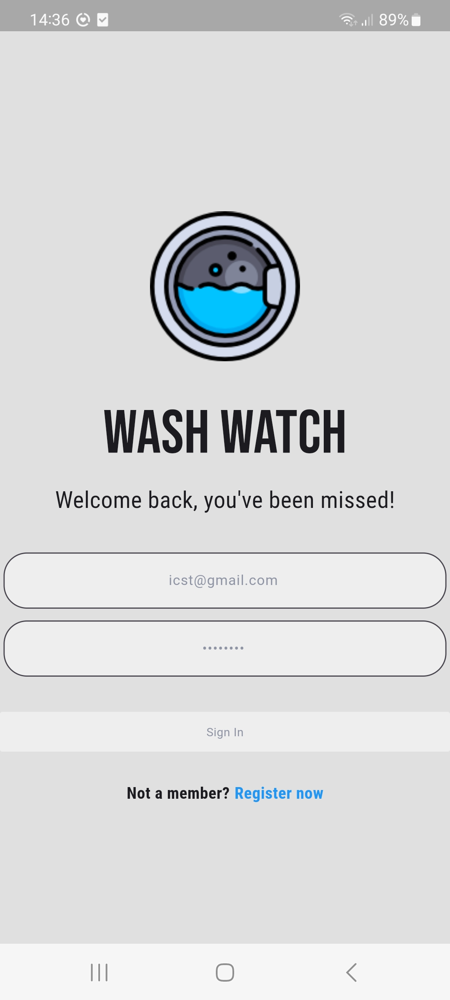
  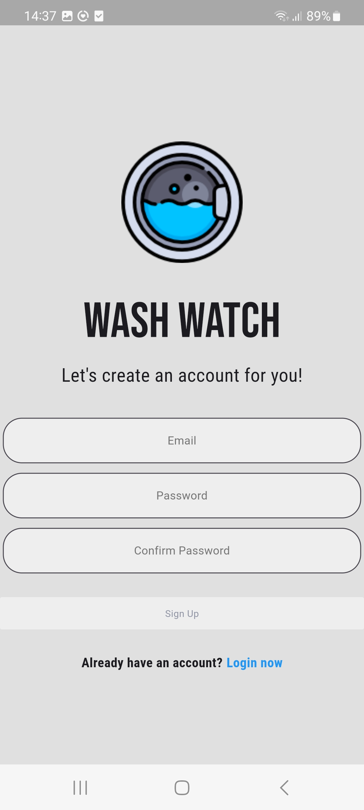

- **Home Page:**

  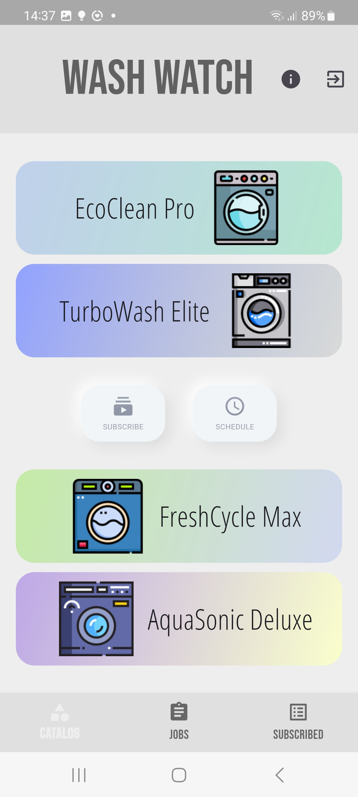

- **Schedule Dialog:**

  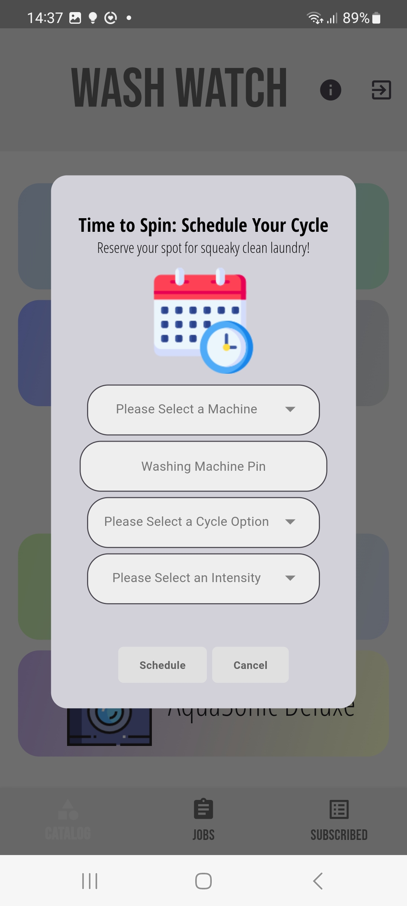

- **Subscribe Dialog:**

  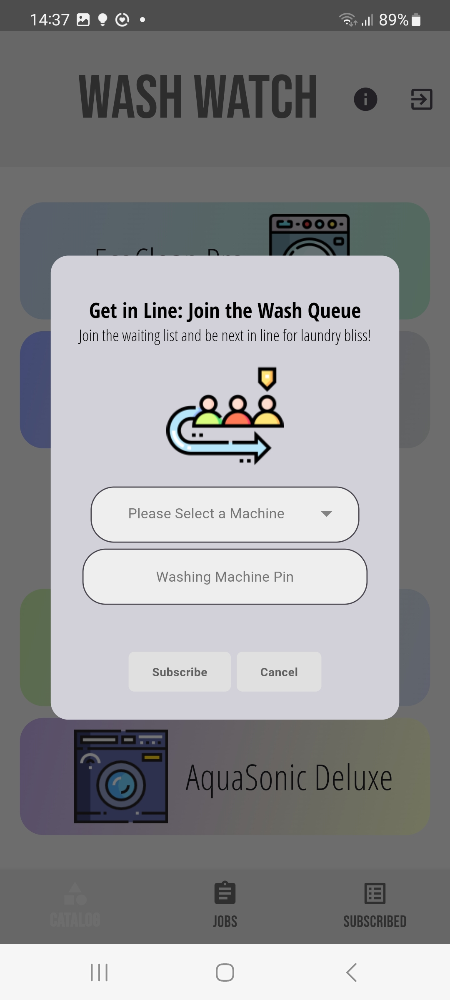

- **Machine Metadata:**

  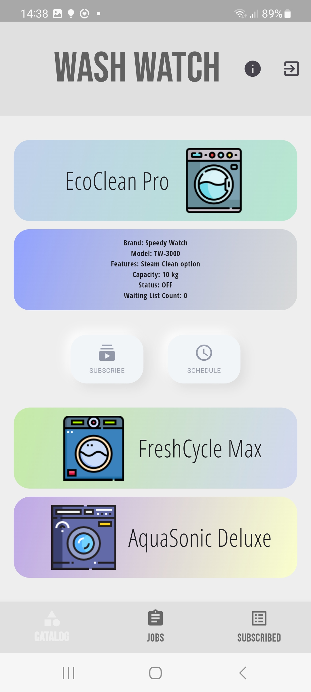
  
- **Job Page Processing:**

  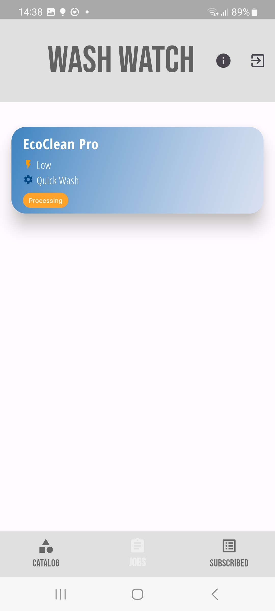

- **Job Page in Progress:**

  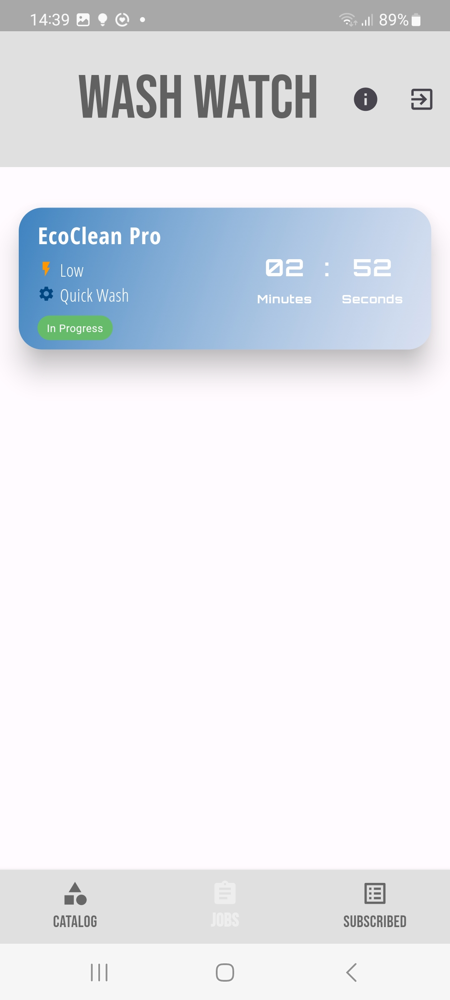

- **Subscribed in Progress:**

  

- **Early Finish Notification:**

  

- **Finish Notification:**

  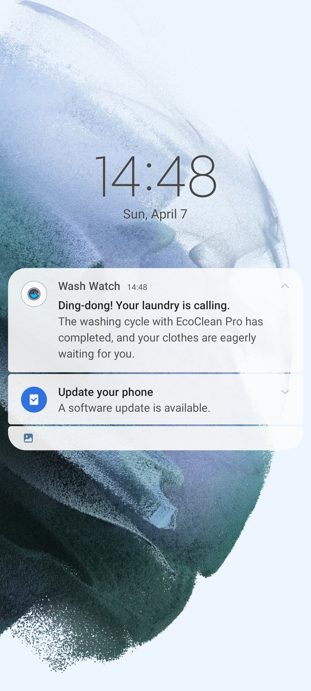

- **Wrong PIN Dialog:**

  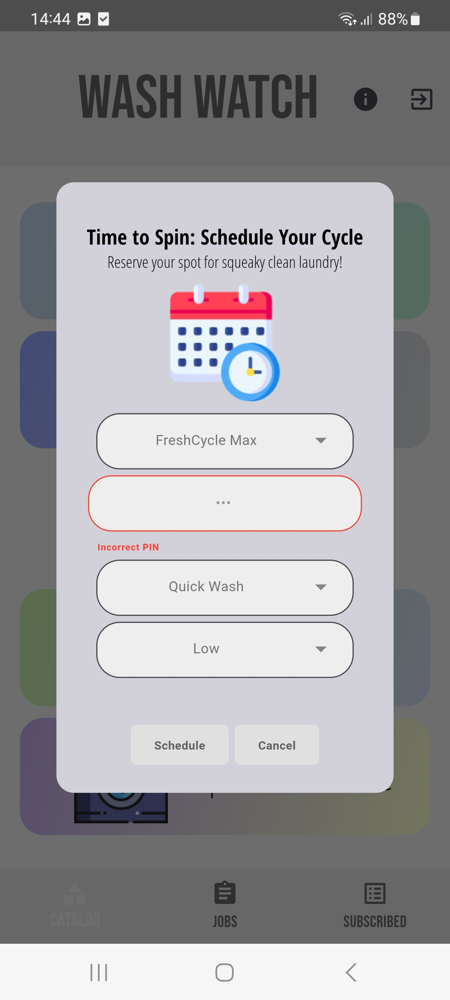

- **Machine Busy Snackbar:**

  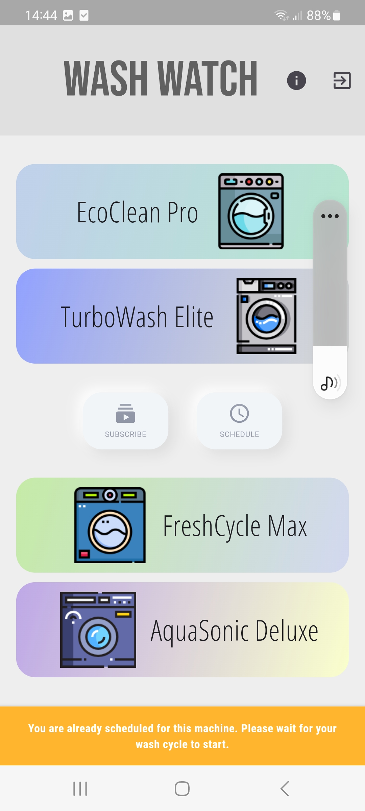

- **Intensity Issue Notification:**

  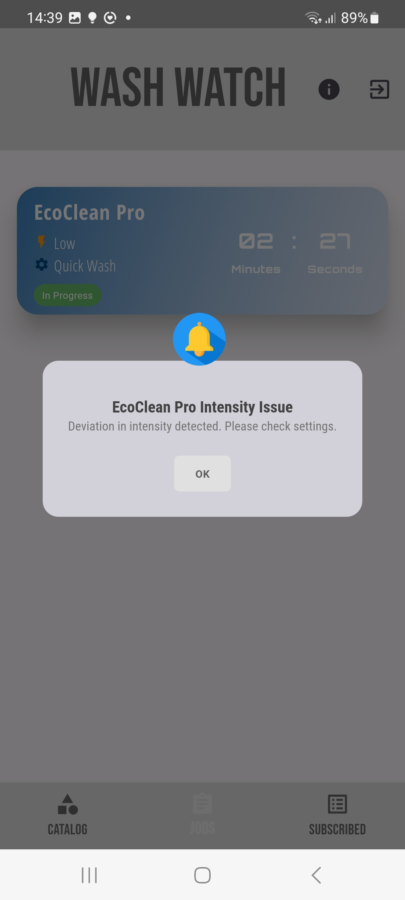

- **Intensity Issue Resolved Notification:**

  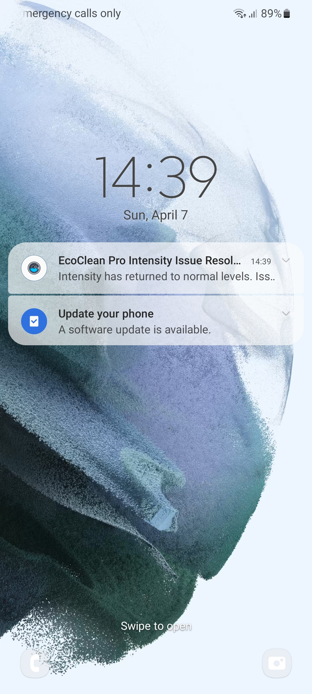

- **Door Open Notification:**

  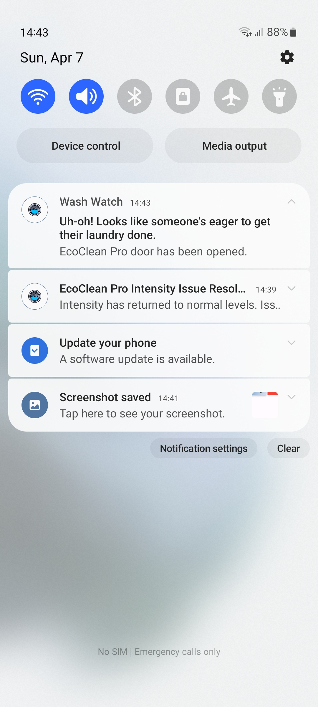

- **Unsubscribe Dismiss:**

  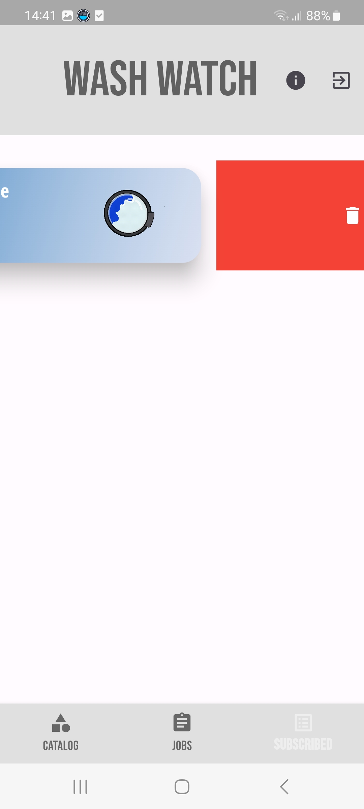

- **Usage Dialog:**

  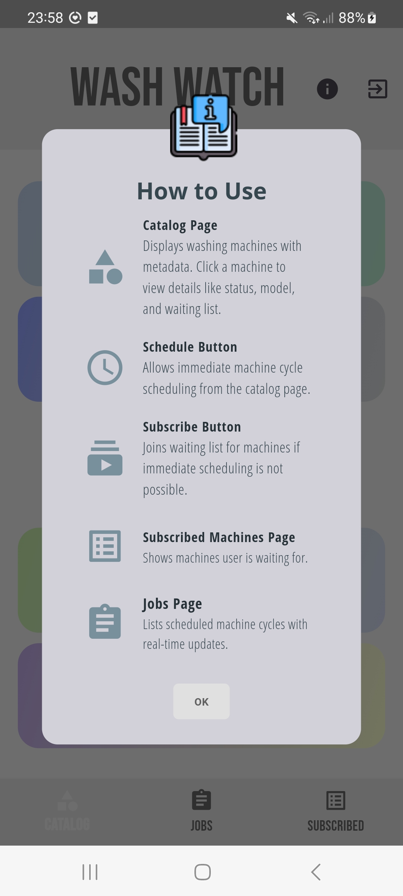
