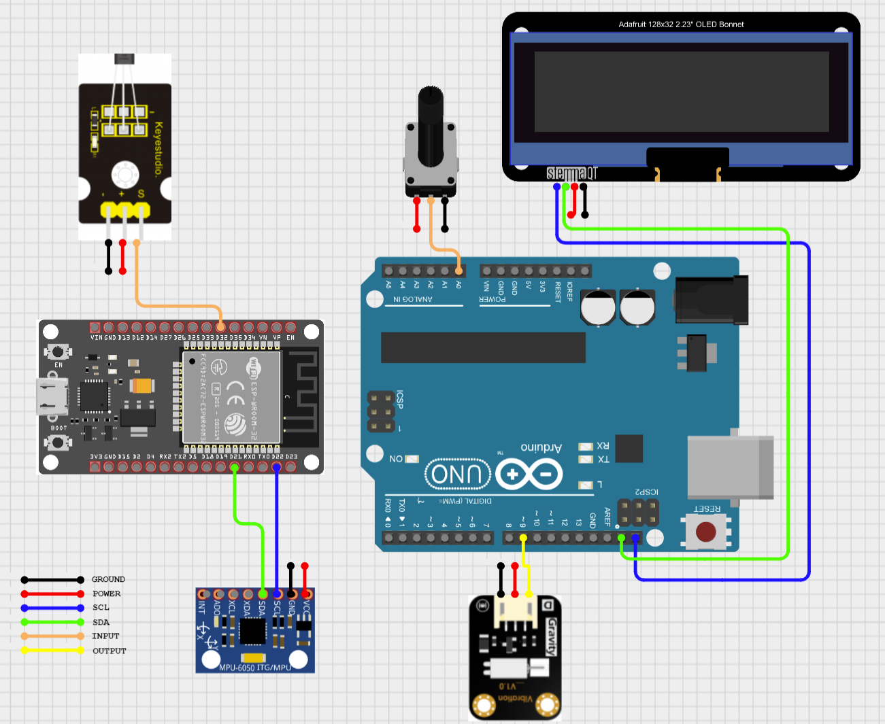

# Washing Machine Alert Project by : Fatimah Alzahraa Fahoum, Aseel Arrabieh, Raghed Abed Alaziz

# Project Overview: Washing Machine Alert

The Washing Machine Alert project offers a comprehensive solution for interacting and interfacing with washing machines. It seamlessly integrates real and simulated washing machines, providing users with an intuitive platform to manage laundry tasks efficiently.

At its core, the project enables users to schedule jobs, reserve machines, or join waiting lists if a machine is unavailable. Through a user-friendly catalog page, users can monitor machine statuses and waiting list counts in real-time.

Push notifications, facilitated by cloud functions, keep users informed about various aspects of machine operations, including vibration intensity, cycle completion, and door status. Additionally, users can effortlessly monitor subscribed machine statuses and track ongoing cycles through a dedicated job list and configurable timers.

With its robust functionality and user-centric design, Washing Machine Alert simplifies the laundry management process, offering a seamless and efficient experience for users.

## Key Features

### Vibration Detection and Intensity Monitoring
- Utilizes an accelerometer sensor attached to the vibration motor.
- Implements an algorithm to analyze sensor data for determining vibration intensity.
- Monitors vibration intensity to ensure the washing machine operates at specified levels.
- Allows manual control of vibration intensity via a potentiometer.
- Alerts users if the machine is not operating at the specified intensity.

### Washing Cycle Completion Notification
- Implemented cloud function triggers notification when the washing cycle finishes.
- Sends notifications to subscribed users, adapting to the application's state (background/foreground).

### Door State Detection and Notification
- Utilizes an algorithm to analyze sensor data for determining door state.
- Sends notifications to subscribed users when the door status changes from clost to open.

### User Subscription and Authentication
- Provides users with the option to subscribe to their washing machine.
- Requires authentication via PIN entry for subscription, ensuring security.
- Compares entered PIN against the one stored in the database for validation.

### Washing Machine Status Visualization
- Enhances user experience by providing real-time insights into the machine's operating status.
- Offers a convenient interface to monitor laundry cycle progress, machine usage, and potential issues.

### Multi-Washing Machine Support
- The system seamlessly integrates real and simulated washing machines.

### Waiting List and Timer Visualization
- Introduces a waiting list feature for scheduling laundry sessions.
- Includes a visual timer display to inform users of remaining cycle time.

### WiFi Configuration and Recovery
- Simplifies initial setup through WiFi configuration via device access point.
- Ensures robust WiFi reconnection mechanisms on ESP devices to minimize disruptions caused by network issues.
- Utilizes heartbeat mechanism for automatic recovery in case of network disconnections, ensuring uninterrupted connectivity.

# Used ESP/Arduino Libraries

1. **adafruit/Adafruit MPU6050** - Version ^2.2.6
   - This library provides support for the MPU6050 accelerometer sensor.
   - Link: [Adafruit MPU6050 Library](https://github.com/adafruit/Adafruit_MPU6050)
   
2. **Wire**
   - This library is used for I2C communication and is typically included with Arduino by default.

3. **adafruit/Adafruit BusIO** - Version ^1.9.3
   - Adafruit BusIO is a unified library for implementing I2C/SPI device drivers. It's used for managing communication with various sensors and devices.
   - Link: [Adafruit BusIO Library](https://github.com/adafruit/Adafruit_BusIO)

4. **SPI**
   - This library provides support for SPI communication and is typically included with Arduino by default.

5. **adafruit/Adafruit Unified Sensor** - Version ^1.1.14
   - Adafruit Unified Sensor is a library for abstracting sensor hardware. It provides a common interface for interacting with various sensors.
   - Link: [Adafruit Unified Sensor Library](https://github.com/adafruit/Adafruit_Sensor)

6. **mobizt/Firebase Arduino Client Library for ESP8266 and ESP32** - Version ^4.4.12
   - This library facilitates communication with the Firebase database from ESP8266 and ESP32 microcontrollers.
   - Link: [Firebase Arduino Client Library](https://github.com/mobizt/Firebase-ESP8266)

7. **wnatth3/WiFiManager** - Version ^2.0.16-rc.2
   - WiFiManager simplifies WiFi network configuration on ESP8266 and ESP32 devices by providing an easy-to-use interface for connecting to WiFi networks.
   - Link: [WiFiManager Library](https://github.com/wnatth3/ESP32-WiFiManager)

# Hardware Components Used

1. **Arduino Uno Board** - Quantity: 1
   - Type: Microcontroller

2. **ESP32** - Quantity: 1
   - Type: Microcontroller

3. **Potentiometer** - Quantity: 1
   - Description: A potentiometer is used for controlling the intensity of vibration motors. It allows users to manually adjust the vibration intensity of the washing machine.

4. **OLED 0.91 inch 128x32 Display** - Quantity: 1
   - Description: The OLED display is used for visualizing vibration intensity levels. It provides an intuitive interface for users to monitor and adjust vibration settings easily.

5. **Gravity Motor Vibration Module** - Quantity: 1
   - Description: The vibration module simulates the operation of a washing machine. It is controlled by the Arduino Uno to generate vibrations during the washing cycle.

6. **MPU6050 Accelerometer Sensor** - Quantity: 1
   - Description: The MPU6050 sensor is used for measuring vibration readings. It detects changes in acceleration and provides data for analyzing the intensity of vibrations during operation.

7. **Hall Effect Sensor** - Quantity: 1
   - Description: The Hall Effect sensor is used for detecting the state of the washing machine door. It measures changes in the magnetic field to determine whether the door is open or closed.

8. **Circular Magnets** - Quantity: 2
   - Description: Circular magnets are attached to the washing machine door to interact with the Hall Effect sensor. They facilitate door open and close detection by creating magnetic fields that are sensed by the sensor.

# Connection Diagram

# Folder Structure Overview

1. **Arduino**
   - Description: Includes the code for controlling the vibration motor using an Arduino Uno board.

2. **ESP32**
   - Description: Contains the code for the ESP32 microcontroller organized as a PlatformIO project.

3. **flutter_app**
   - Description: Contains Dart code for the Flutter application and TypeScript code for cloud functions.

4. **Parameters**
   - Description: Contains descriptions of configurable parameters used in the project.

5. **Unit Tests**
   - Description: Contains folders for software and hardware unit testing.

6. **Documentation**
   - Description: Contains various documentation files related to the project.
   - **connection diagram:** Diagram illustrating the hardware connections.
   - **heartbeat mechanism documentation:** Documentation explaining the implementation of the heartbeat mechanism for recovery.
   - **vibration detection algorithm documentation:** Documentation detailing the algorithm used for vibration detection.
   - **user test documentation:** Documentation outlining the user testing process and results.
   - **system states and errors documentation:** Documentation describing system states, errors, and how they are handled.
   - **user interface documentation:** Documentation detailing the user interface design and functionality.
   - **edge cases and recovery and desired behavior documentation:** Documentation covering edge cases, recovery mechanisms, and desired system behavior.

# Project Poster

This project is part of ICST - The Interdisciplinary Center for Smart Technologies, Taub Faculty of Computer Science, Technion https://icst.cs.technion.ac.il/
[poster.pdf](https://github.com/user-attachments/files/16216500/poster.pdf)
